### Optimized textures (2015)

Group exhibition at [Kestner Gesellschaft](https://kestnergesellschaft.de/) in Hannover, Germany.

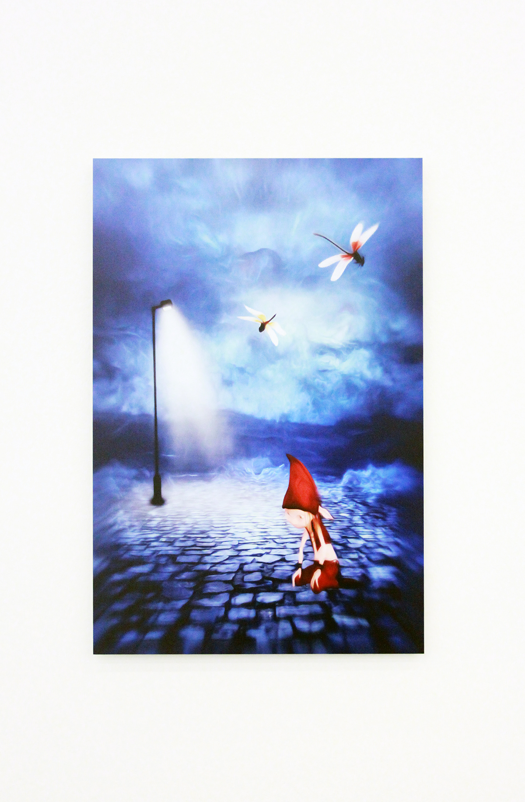
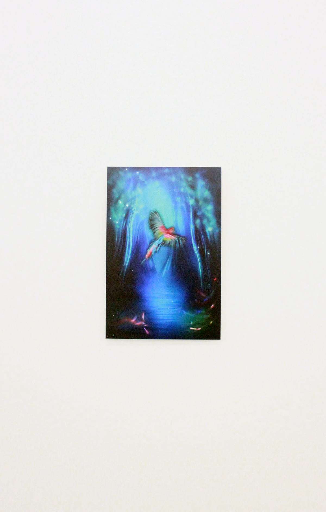
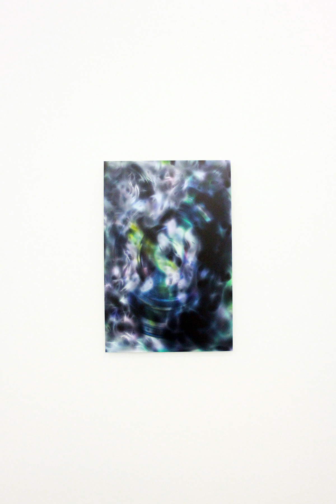

3D-printed sculpture made on Zbrush.

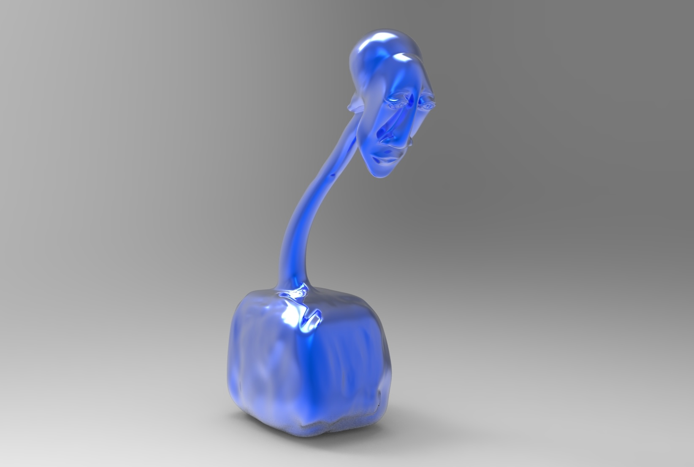
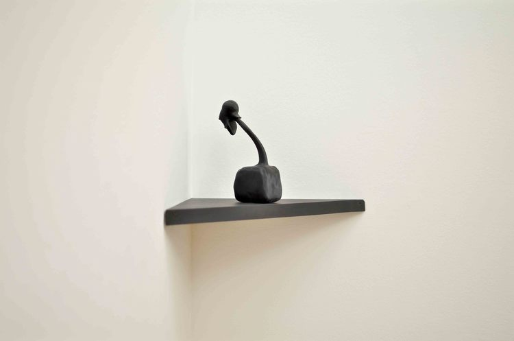

### Profit/Prophet (2014)

Group exhibition at St. Johannes-Evangelist-Kirche for Berlin Art Week 2014.

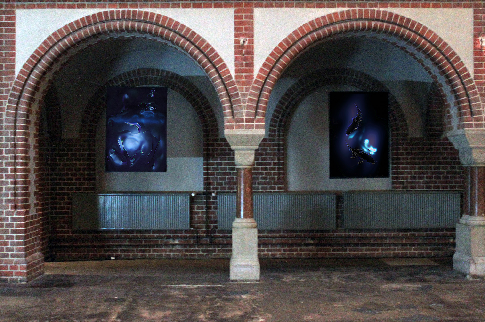

### Was tust du, Objekt? (2015)

Group exhibition at [Gypsum Gallery](http://gypsumgallery.com/) in Cairo.

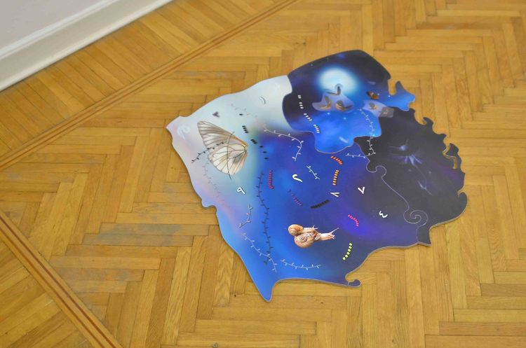
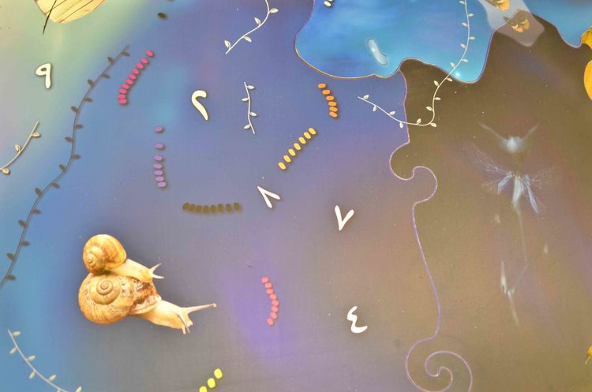
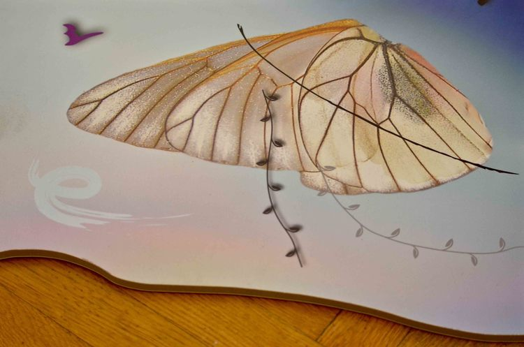

### Nile Sunset Annex (2014)

Documentation of a solo show at Nile Sunset Annex Gallery, an artist-run project in Cairo.

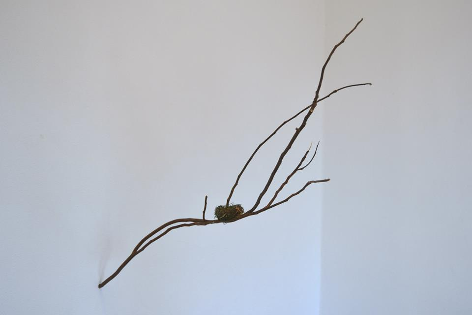
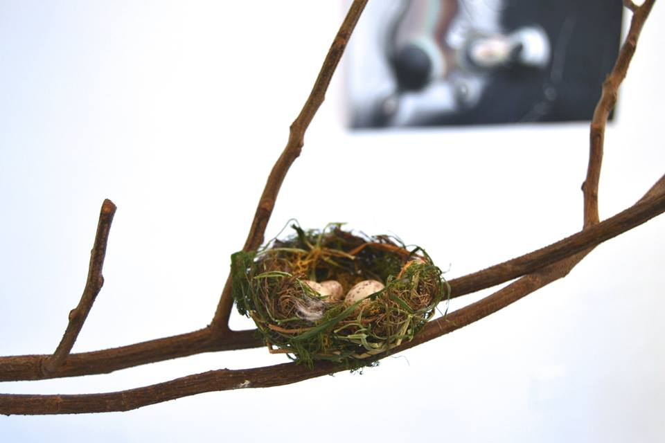
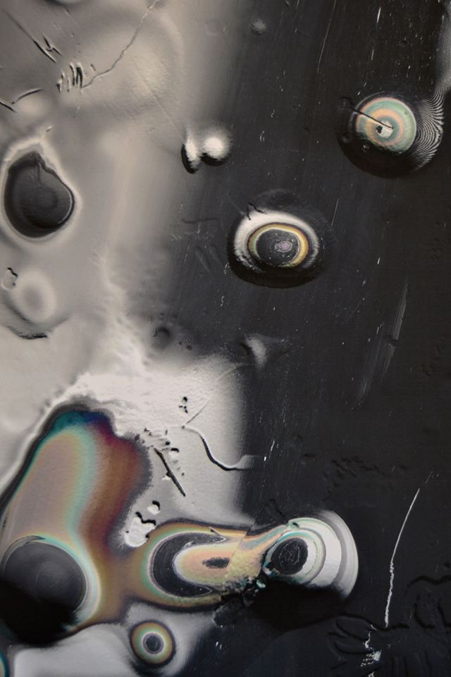
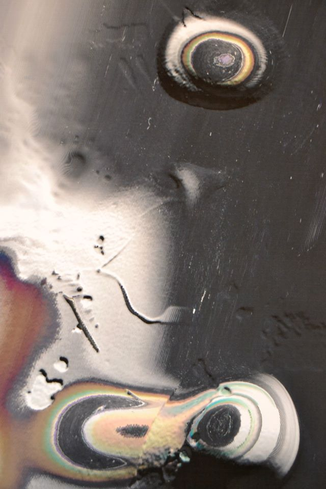
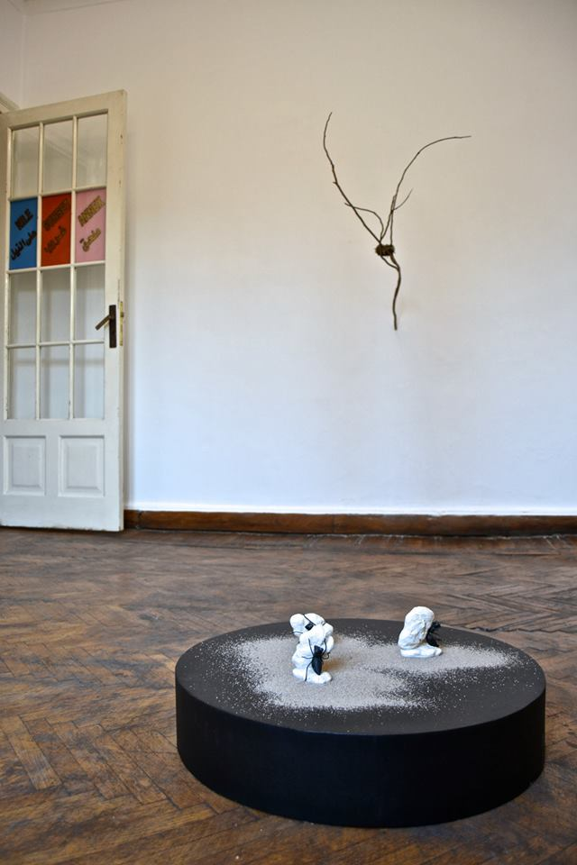

### New Aesthetics (2013)

Computer-generated imagery for a group show at National Center for Contemporary Art in Yekaterinburg, Russia.

### Quiet Chatrooms (2012)

_Quiet Chatrooms_ is a web-based environment, exhibited on Fach & Asendorf Gallery and archived at [Rhizome
ArtBase](https://artbase.rhizome.org/wiki/Main_Page).

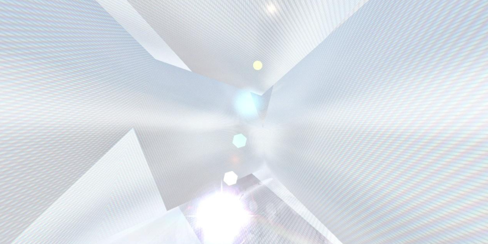

### Other

* Dragon sleeper (2012), a mixed-media installation. Video excerpt on [Vimeo](https://vimeo.com/46805702).
* Meanwhile, a whale cries (2011), video art. Excerpt on [Vimeo](https://vimeo.com/70230495).
